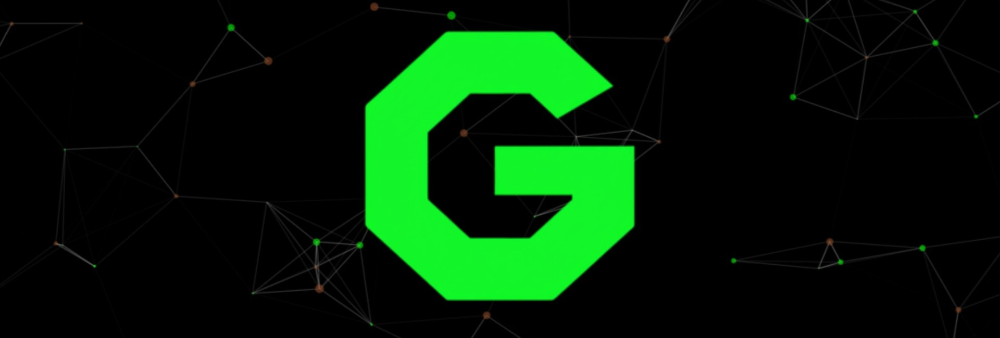

  

# Meu Portifólio
# [Link código](https://github.com/GuiFelSS/Portif-lio-Code)
# [Link Portifólio](https://guifelssportifolio.vercel.app/)
**Bem-vindo(a) ao meu canto na internet!** Este portfólio é onde eu apresento meus trabalhos feitos dentro e fora do ambiente acadêmico e tudo o que venho aprendendo na minha jornada em **Análise e Desenvolvimento de Sistemas**.

A criação deste projeto foi uma jornada de pesquisa, inspiração e, claro, muito código para tirá-lo do papel. Utilizando **Next.js**, busquei criar um espaço que demonstrasse **minhas habilidades** e a evolução do meu trabalho. Apesar de não ser um especialista em design, foquei em criar uma boa experiência de usuário, para que o destaque fosse o que realmente importa: **as soluções e os projetos desenvolvidos**.

Cada projeto aqui representa um degrau no meu **crescimento** e a materialização da minha paixão por tecnologia. **Meu grande objetivo é encontrar um lugar onde eu possa continuar aprendendo, contribuindo e ajudando a construir coisas incríveis.** E, secretamente, espero que você que está lendo isto agora seja a ponte para essa oportunidade (por favor, nunca te pedi nada 🙏 kkkk).

Explore meus trabalhos e veja o que um desenvolvedor **dedicado** (e com um **bom senso de humor**, pelo menos é o que dizem, espero que ninguém nunca tenha mentido para mim kkkk) pode fazer. Se a sua equipe precisa de alguém assim, **vamos conversar!** Desde já agradeço pela atenção.
